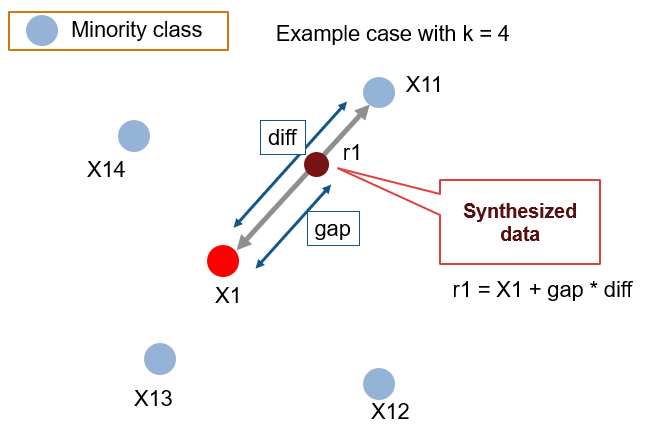
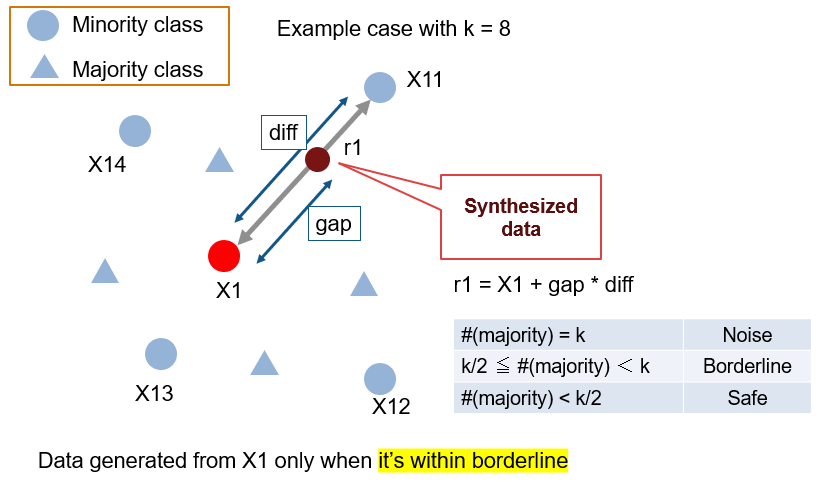
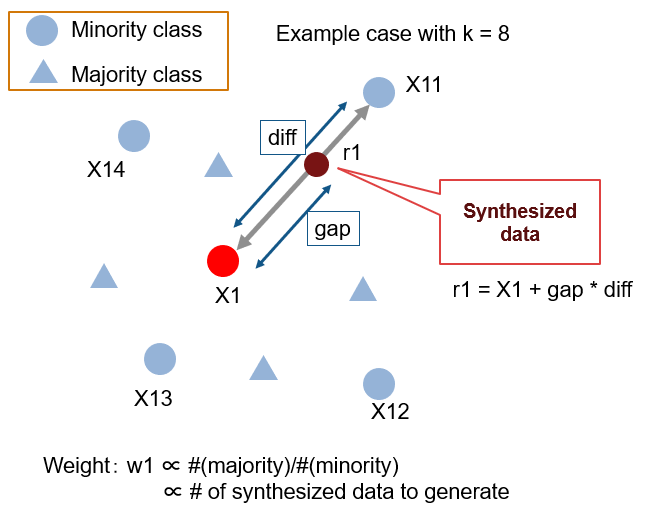
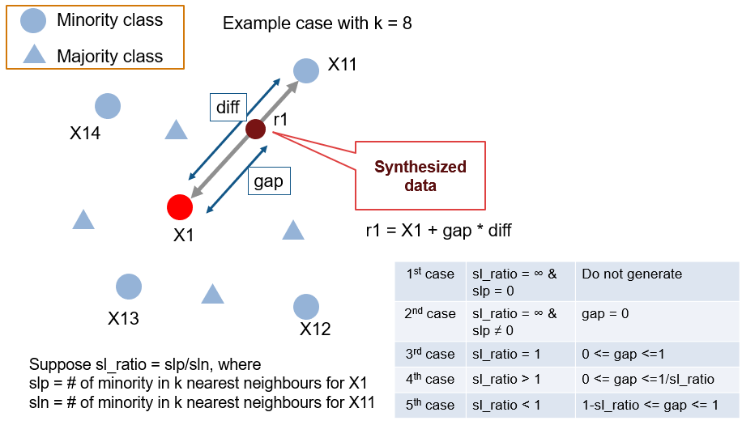

# Oversampling for class imbalanced dataset
MATLAB Implementation of the following four SMOTE related algorithms

- SMOTE (Chawla, NV. et al. 2002)[1]
- Borderline SMOTE (Han, H. et al. 2005)[2]
- ADASYN (He, H. et al. 2008)[3]
- Safe-level SMOTE (Bunkhumpornpat, C. at al. 2009)[4]

Example of the synthesizing process by Safe-level SMOTE.

## Environment
 MATLAB R2019b 

## A graphical explanation of the algorithms.

### SMOTE (Chawla, NV. et al. 2002)[1]

### Borderline SMOTE (Han, H. et al. 2005)[2]

### ADASYN (He, H. et al. 2008)[3]

### Safe-level SMOTE (Bunkhumpornpat, C. at al. 2009)[4]

# Reference
[1]: Chawla, N. V., Bowyer, K. W., Hall, L. O., & Kegelmeyer, W. P. (2002). SMOTE: synthetic minority over-sampling technique. Journal of artificial intelligence research, 16, 321-357.

[2]: Han, H., Wang, W. Y., & Mao, B. H. (2005). Borderline-SMOTE: a new over-sampling method in imbalanced data sets learning. In International conference on intelligent computing (pp. 878-887). Springer, Berlin, Heidelberg.

[3]: He, H., Bai, Y., Garcia, E. A., & Li, S. (2008). ADASYN: Adaptive synthetic sampling approach for imbalanced learning. In 2008 IEEE International Joint Conference on Neural Networks (pp. 1322-1328). IEEE.

[4]: Bunkhumpornpat, C., Sinapiromsaran, K., & Lursinsap, C. (2009). Safe-level-smote: Safe-level-synthetic minority over-sampling technique for handling the class imbalanced problem. In Pacific-Asia conference on knowledge discovery and data mining (pp. 475-482). Springer, Berlin, Heidelberg.
