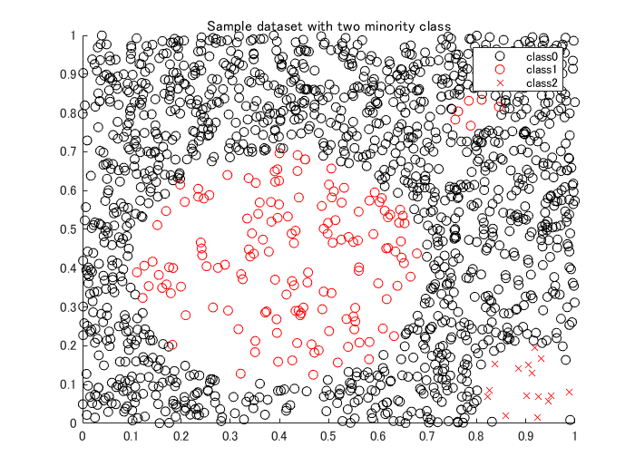
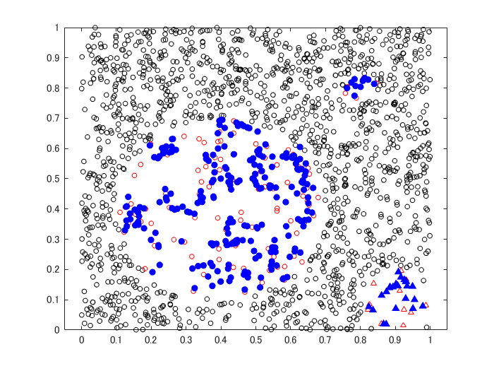
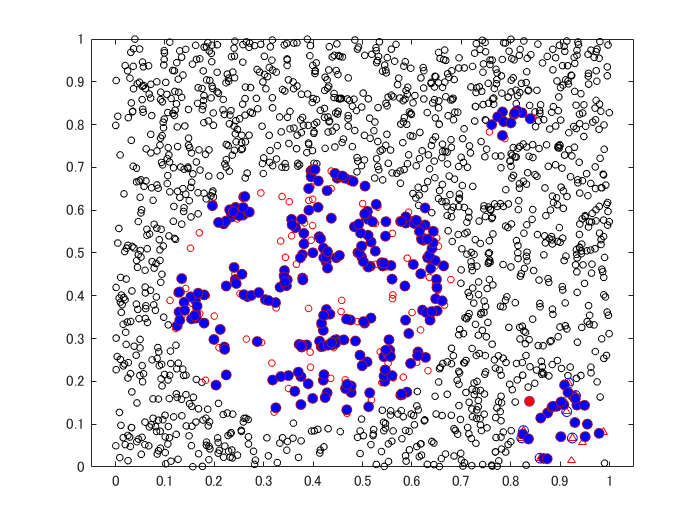
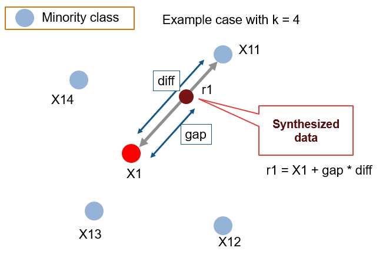
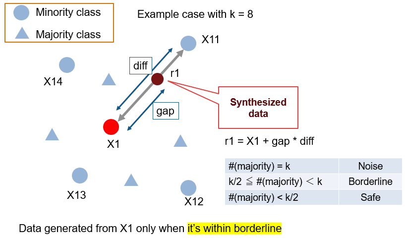
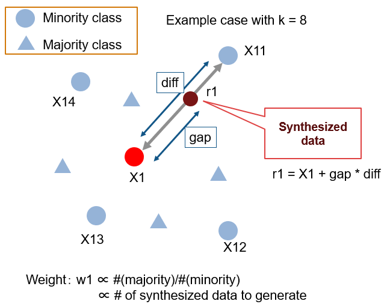
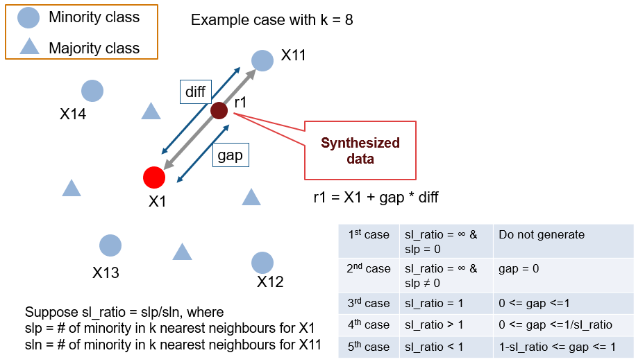

# Oversampling with SMOTE with its relative algorithms

   -  SMOTE (Chawla, NV. et al. 2002)[1]  
   -  Borderline SMOTE (Han, H. et al. 2005)[2]  
   -  ADASYN (He, H. et al. 2008)[3]  
   -  Safe-level SMOTE (Bunkhumpornpat, C. at al. 2009)[4]  


Copyright (c) 2019 Michio Inoue


# Example: Creating sample data
```matlab
clear;
close all;
addpath('./functions');
rng(0)

Ndata = 2000;
data = rand(Ndata,2);

x = data(:,1);
y = data(:,2);
```


Define the two minority class in three circles.


```matlab
% center = (0.4,0.4), radius = 0.3
idx1a = (x-0.4).^2 + (y-0.4).^2 < 0.3^2;
% center = (0.8,0.8), radius = 0.05
idx1b = (x-0.8).^2 + (y-0.8).^2 < 0.05^2;
% center = (0.9,0.1), radius = 0.1
idx2 = (x-0.9).^2 + (y-0.1).^2 < 0.1^2;

% decrease the number of samples for two minority class
undersampleRate = 4; % Undersample rate
data1 = data(idx1a|idx1b,:);
data1 = data1(1:undersampleRate:end,:);
data2 = data(idx2,:);
data2 = data2(1:undersampleRate:end,:);

% delete those from the original datset
data(idx1a|idx1b|idx2,:) = [];

% plot
figure(1)
scatter(data(:,1),data(:,2),'black','o');
hold on
scatter(data1(:,1),data1(:,2),'red','o');
scatter(data2(:,1),data2(:,2),'red','x');
hold off
title("Sample dataset with two minority class")
legend("class0","class1","class2")
```



# Check the number of data for each class
```matlab
label0 = repmat("class0",length(data),1);
label1 = repmat("class1",length(data1),1);
label2 = repmat("class2",length(data2),1);

dataset = array2table([data;data1;data2]);
dataset = addvars(dataset, [label0;label1;label2],...
    'NewVariableNames','label');
labels = dataset(:,end);
t = tabulate(dataset.label)
```
| |1|2|3|
|:--:|:--:|:--:|:--:|
|1|'class0'|1338|88.9037|
|2|'class1'|152|10.0997|
|3|'class2'|15|0.9967|

```matlab
uniqueLabels = string(t(:,1));
labelCounts = cell2mat(t(:,2));
```
# Synthesize data


Define the number of data point to synthesize and algorithms to use.


```matlab
num2Add = [0,200,20];
algorithm = "Safe-level SMOTE";
```


Defile the number of neighbors to use


```matlab
k = 10;
newdata = table;
visdataset = cell(length(uniqueLabels),1);

% for each class
for ii=1:length(uniqueLabels)
    switch algorithm
        case "SMOTE"
            [tmp,visdata] = mySMOTE(dataset,uniqueLabels(ii),num2Add(ii),...
                "NumNeighbors",k, "Standardize", true);
        case "ADASYN"
            [tmp,visdata]  = myADASYN(dataset,uniqueLabels(ii),num2Add(ii),...
                "NumNeighbors",k, "Standardize", true);
        case "Borderline SMOTE"
            [tmp,visdata] = myBorderlineSMOTE(dataset,uniqueLabels(ii),num2Add(ii),...
                "NumNeighbors",k, "Standardize", true);
        case "Safe-level SMOTE"
            [tmp,visdata] = mySafeLevelSMOTE(dataset,uniqueLabels(ii),num2Add(ii),...
                "NumNeighbors",k, "Standardize", true);
    end
    newdata = [newdata; tmp];
    visdataset{ii} = visdata;
end
```
## Visualize results
```matlab
figure(2)
gscatter(dataset.Var1,dataset.Var2,dataset.label,'krr','oo^',4,'off');
hold on
h = gscatter(newdata.Var1,newdata.Var2,newdata.label,'bb','o^',5,'off');
for n = 1:length(h)
    color = get(h(n),'Color');
    set(h(n), 'MarkerFaceColor', color);
end
hold off
```



# Visualize the results in animation
```matlab
figure(3)
createGIF = false;
% original dataset
gscatter(dataset.Var1,dataset.Var2,dataset.label,'krr','oo^',4,'off');
hold on
% objects to show the process
% a data from the original data
hl1 = plot(0,0,'LineStyle','none','Marker','o','MarkerFaceColor','red');
% all neighboring points
hl2 = plot(0,0,'LineStyle','none','Marker','o','MarkerEdgeColor','blue');
% a neighboring point to use for synthesize new data
hl3 = plot(0,0,'LineStyle','none','Marker','o','MarkerFaceColor','green');
% a synthesized data
y = visdata{1,4}; % first sample
hl4 = plot(y(1),y(2),'LineStyle','none','Marker','o','MarkerFaceColor','blue');

filename = 'OverSamplingImbalancedData.gif'; % Specify the output file name

index = 0;
for ii=1:length(uniqueLabels)
    visdata = visdataset{ii};
    if length(visdata) == 1
        continue
    end
    for jj=1:length(visdata)
        index = index + 1;
        % 1: y, 2: nnarray, 3: y2, 4: synthetic data
        y = visdata{jj,1};
        yknn = visdata{jj,2};
        y2 = visdata{jj,3};
        newy = visdata{jj,4};
        
        % a data from the original data
        hl1.XData = y(1);
        hl1.YData = y(2);
        % all neighboring points
        hl2.XData = yknn(:,1);
        hl2.YData = yknn(:,2);
        % a neighboring point to use for synthesize new data
        hl3.XData = y2(1);
        hl3.YData = y2(2);
        % a synthesized data
        hl4.XData = [hl4.XData,newy(1)];
        hl4.YData = [hl4.YData,newy(2)];
        
        drawnow
        pause(0.1)
        
        if createGIF
            frame = getframe(3);
            tmp = frame2im(frame);
            [A,map] = rgb2ind(tmp,256);
            if index == 1
                imwrite(A,map,filename,'gif','LoopCount',Inf,'DelayTime',0.5);
            else
                imwrite(A,map,filename,'gif','WriteMode','append','DelayTime',0.5);
            end
        end
        
    end
end
hold off
```



# Reference and its graphical explanation


[1]: Chawla, N. V., Bowyer, K. W., Hall, L. O., \& Kegelmeyer, W. P. (2002). SMOTE: synthetic minority over-sampling technique. Journal of artificial intelligence research, 16, 321-357. 


[2]: Han, H., Wang, W. Y., \& Mao, B. H. (2005). Borderline-SMOTE: a new over-sampling method in imbalanced data sets learning. In International conference on intelligent computing (pp. 878-887). Springer, Berlin, Heidelberg. 


[3]: He, H., Bai, Y., Garcia, E. A., \& Li, S. (2008). ADASYN: Adaptive synthetic sampling approach for imbalanced learning. In 2008 IEEE International Joint Conference on Neural Networks (pp. 1322-1328). IEEE. 


[4]: Bunkhumpornpat, C., Sinapiromsaran, K., \& Lursinsap, C. (2009). Safe-level-smote: Safe-level-synthetic minority over-sampling technique for handling the class imbalanced problem. In Pacific-Asia conference on knowledge discovery and data mining (pp. 475-482). Springer, Berlin, Heidelberg.


## SMOTE (Chawla, NV. et al. 2002)





## Borderline SMOTE (Han, H. et al. 2005)





## ADASYN (He, H. et al. 2008)





## Safe-level SMOTE (Bunkhumpornpat, C. at al. 2009)





